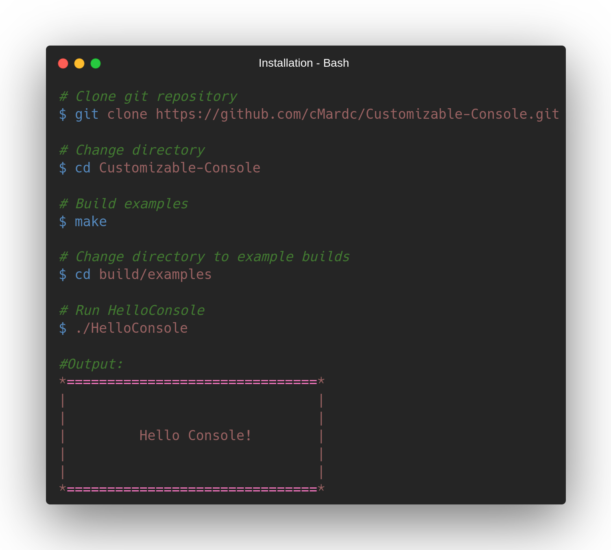
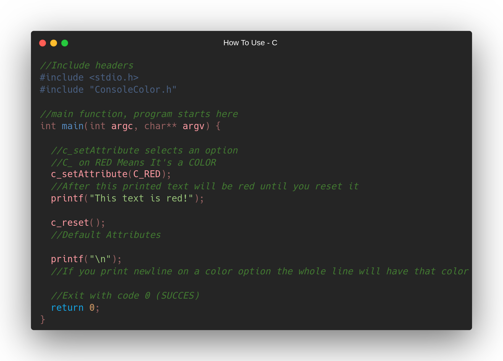
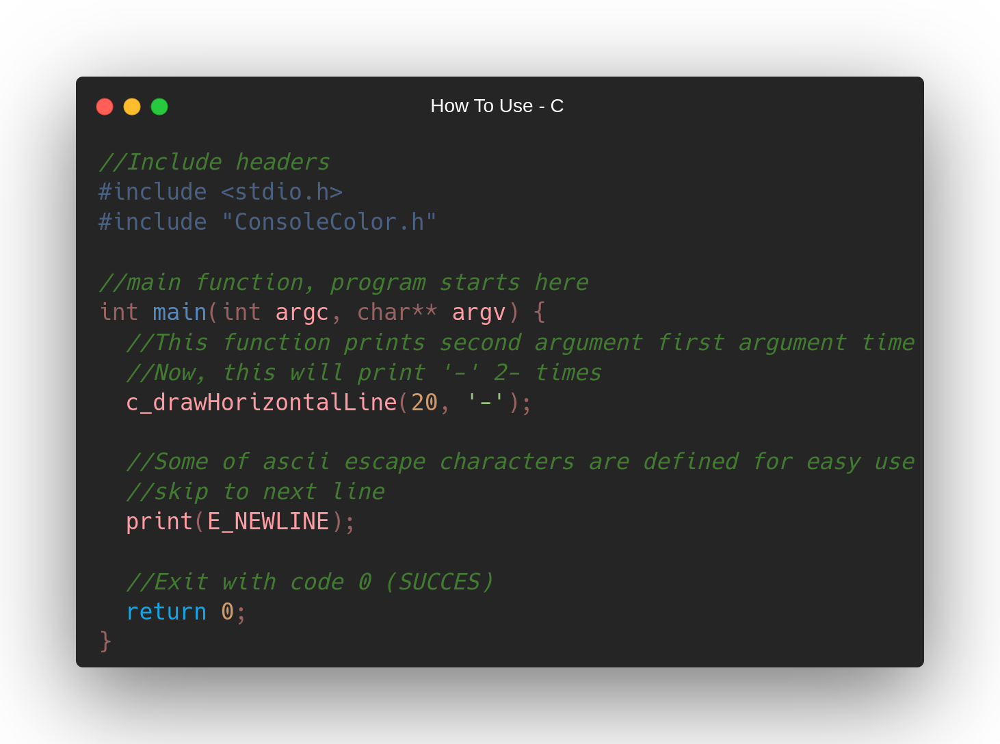
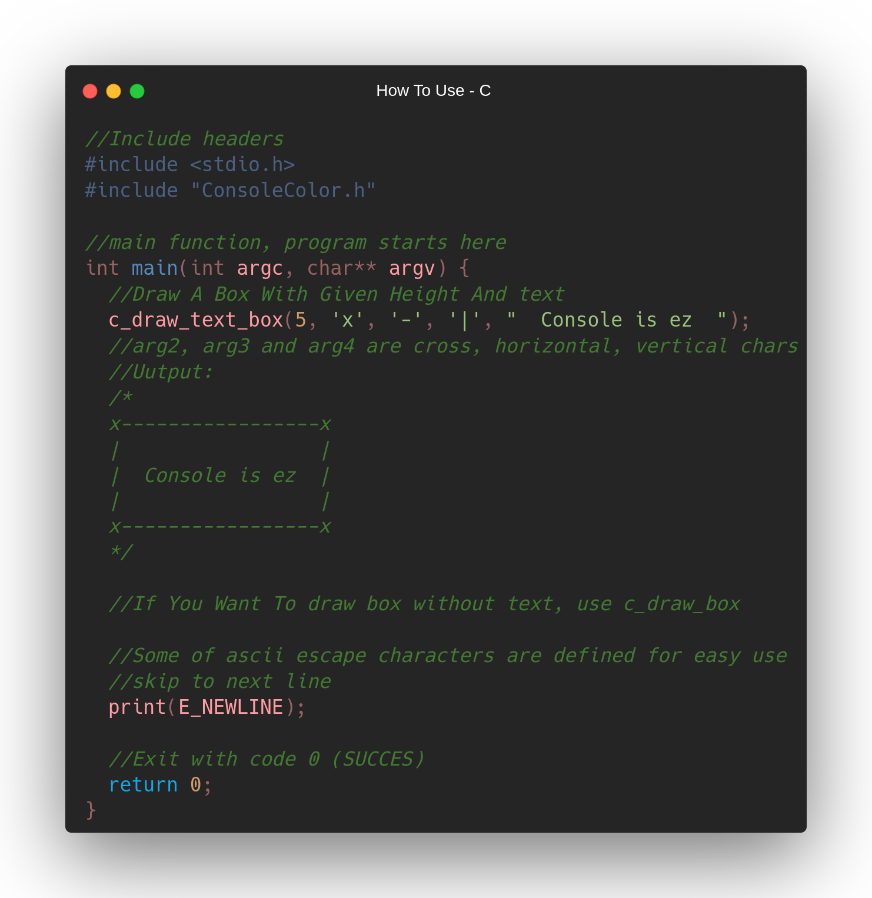
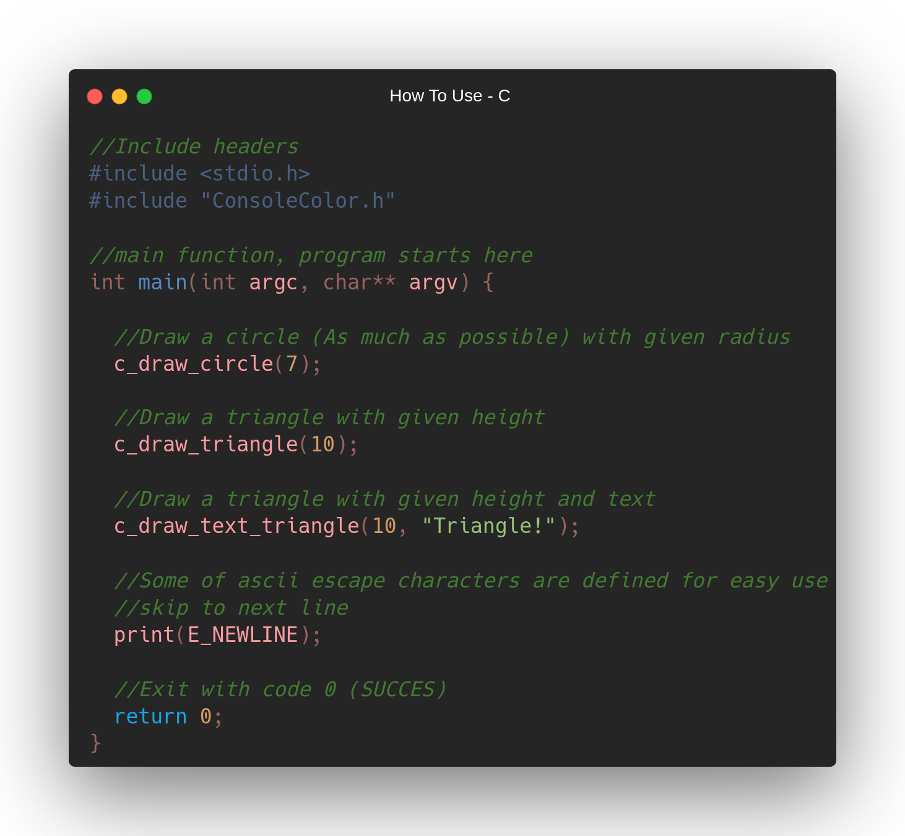
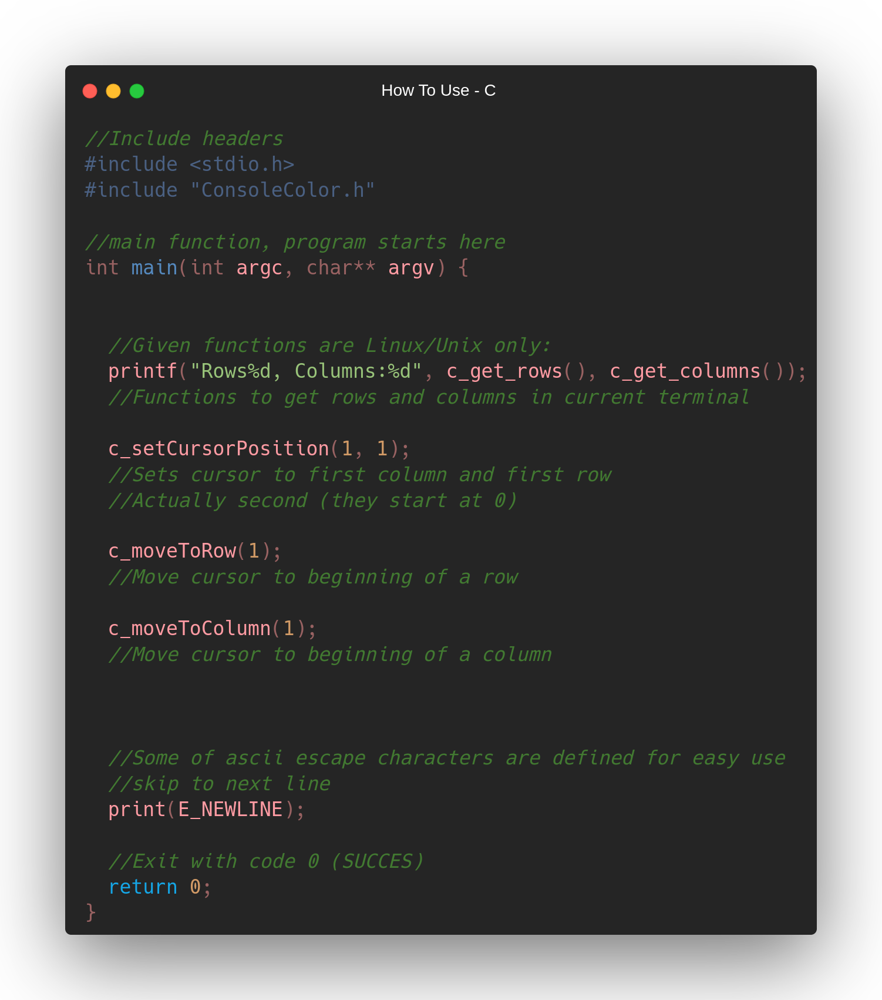

 
 
 
 

 

 
 
 

<h2>Platform Support</h2>
<h4>Supports for platforms: </h4>

| OS       | USE                    |
| -------- | ---------------------- | 
| Windows  | Limited                |
| Linux    | Fully Working          |
| MacOS    | Limited                |

<h2>Installation</h2>

<h4>You can just copy header file in src directory, but if you want all documents, examples and source i used, you can copy git repo.</h4>

<h2>How To Use</h2>
<h4>There are couple of functions and attributes you can use. To understand things better we have naming styles. They are separated from original name with underline ('_'). Here are they: </h4>

| Style    | Type                   |
| -------- | ---------------------- | 
| C        | Foreground Color       |
| BG       | Background Color       |
| S        | Text Styles            |
| A        | Reset Property         |
| E        | ASCII Escape Sequences |
| c        | Functions              |

<h4>Now let's look at functions we can use.</h4>
<h3>c_setAttribute</h3>
<h4>This function gets a parameter (like C, BG or S) and applies it.</h4>

<h3>c_drawHorizontalLine</h3>
<h4>This function draws a line on screen.</h4>

<h3>c_draw_text_box And c_draw_box</h3>
<h4>These functions draws a box on screen, c_draw_text_box also prints text inside box</h4>

<h3>c_draw_circle, c_draw_triangle And c_draw_text_triangle</h3>
<h4>These functions draws different shapes on screen.</h4>

<h3>Linux only functions</h3>
<h4>Given functions are linux only:</h4>

<h3>Use cases</h3>
<h4>Trying to make game or a visual app with this header file is not recommended, But this library helps you make your terminal app look a bit better, but not like a true visual app. If you're looking for a basic library / header / framework to make a C/C++ GUI app, I prefer you to use WinForms extension for C++.</h4>

<h3>Thanks for selecting us!</h3>
<h4>Made by ~cM</h4>
<h5>More Info: </h5>

<h5>Other links : </h5>
<a href="https://discord.gg/5W4XtHkc6g">Discord</a>
<a href="https://github.com/cMardc">Github</a>
<a href="https://stackoverflow.com/users/21458468/merd-ceferzade">Stack Overflow</a>

